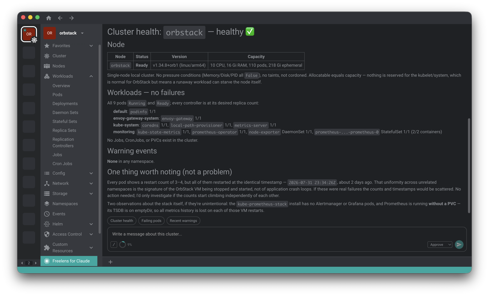

# @freelensapp/for-claude-extension

<!-- markdownlint-disable MD013 -->

[](https://freelens.app)
[](https://github.com/freelensapp/freelens-for-claude-extension)
[](https://github.com/freelensapp/freelens-for-claude-extension/releases)
[](https://github.com/freelensapp/freelens-for-claude-extension/actions/workflows/unit-tests.yaml)
[](https://github.com/freelensapp/freelens-for-claude-extension/actions/workflows/integration-tests.yaml)
[](https://github.com/freelensapp/freelens-for-claude-extension/discussions/40)
[](https://www.npmjs.com/package/@freelensapp/for-claude-extension)

<!-- markdownlint-enable MD013 -->

## Overview

Freelens for Claude embeds a Claude-powered chat directly in Freelens, with
one conversation per cluster. Claude answers questions about the selected
cluster and can act on it — but only through a set of typed,
permission-gated Kubernetes tools, never through an unrestricted shell.



Unlike
[freelens-ai-extension](https://github.com/freelensapp/freelens-ai-extension),
this extension is a frontend to **your own Claude Code installation**. There
is no provider selection and no API key to store: the extension spawns the
Claude Code binary already installed on your machine and inherits whatever
authentication it uses. Billing is whatever your Claude Code uses — a Claude
subscription or API usage — and the extension never sees your credentials.

This is a community project, not an official Anthropic product. The name
"Freelens for Claude" uses the "Claude" trademark nominatively to describe
what the extension works with; it does not imply endorsement by or
affiliation with Anthropic.

## Requirements

- **Freelens >= 1.10.0.** The extension is developed against
  `@freelensapp/extensions` 1.10.x and its continuous integration installs
  and smoke-tests it against Freelens 1.10.0. Older releases are not
  verified to provide every host API the extension uses.
- **Claude Code installed and logged in.** The extension drives the Claude
  Code binary found on your `PATH` (or at a path you set in preferences).
  Install it and run `claude` once in a terminal to authenticate.
- Every Claude Code authentication method is inherited unchanged —
  subscription login, `ANTHROPIC_API_KEY`, Amazon Bedrock, or Google
  Vertex. The extension never handles or stores credentials.
- **Node.js** is required only when building the extension from source (see
  [Build from the source](#build-from-the-source)); it is not needed to run
  the extension.

## Installation

Once published, install from the Freelens **Extensions** page by npm name:

```text
@freelensapp/for-claude-extension
```

Alternatively, download the `.tgz` from the
[GitHub releases](https://github.com/freelensapp/freelens-for-claude-extension/releases)
page and drag it into the Freelens window, or provide its path on the
Extensions page.

You can also build and pack the extension yourself — see
[Build from the source](#build-from-the-source).

## Getting started

1. Open a cluster in Freelens.
2. Choose **Freelens for Claude** in the cluster's side menu.
3. If Claude Code is not detected, an onboarding panel explains what is
   missing. Install Claude Code and log in, or point the extension at the
   binary with the **Claude Code executable path** preference, then reopen
   the page.
4. Send your first message — either a quick-prompt chip (for example
   "Cluster health") or free text.
5. From any resource list you can also right-click a Pod, Deployment,
   DaemonSet, StatefulSet, Service, Node, or Event and choose **Ask
   Claude** to open the chat pre-filled with a prompt about that object.

## Features

### Chat

- Streamed markdown answers with syntax-highlighted code blocks.
- A live **Reasoning** fold that shows Claude's thinking as it streams.
- **Stop** the current turn and **Retry** the last one.
- Per-cluster transcripts that survive restarts, backed by Claude Code
  session resume. Hovering a prompt shows when it was sent.
- Tool calls render as collapsible cards. Calls made by the analysis
  subagent are nested under the card that delegated to them.
- A **context donut** in the composer showing how full the context window
  is; clicking it opens a per-category token breakdown.
- Context compaction, automatic or on demand, with a notice in the
  transcript when it happens.

### The command menu

The **[/]** button in the composer opens a popover with two groups. The
**Context** group holds the actions that are not prompts:

<!-- markdownlint-disable MD013 -->

| Entry | What it does |
| --- | --- |
| **Account & Usage...** | Your account and plan, the plan's rate-limit windows, and what has been contributing to them |
| **Switch model (`<current>`)...** | Pick the model for this cluster (see below) |
| **Effort (`<current>`)...** | Pick the reasoning-effort level for this cluster (see below) |
| **Clear conversation** | Start a new chat: drops the transcript and the resumed session id |
| **Compact** | Compact the conversation now, rather than waiting for it to happen automatically |

<!-- markdownlint-enable MD013 -->

The model and effort entries show the active selection in parentheses, so
the menu doubles as a readout of what the next turn will use.

The **Slash Commands** group lists every command your Claude Code
installation exposes, and inserts the chosen one into the composer.

#### Switching model

The model list is read from the Claude Code build you actually have
installed, so it offers exactly what that build supports and labels each
entry with the wire model it resolves to (for example
`Opus - claude-opus-5`). The **Default** row names what the default
currently resolves to, so it is clear what you get by not choosing.

If you need a model the installed build does not list - a pinned or
freshly released id - type it into **Custom model id**. It is accepted as
given; an unknown id is rejected by Claude Code when the turn runs.

The choice is remembered per cluster. To go back to the default, pick the
**Default** row.

#### Effort

**Effort** sets how much reasoning Claude spends per turn: **Low**,
**Medium**, **High**, **Extra High**, or **Max**, plus a **Default** row
(High). A change applies to the running session immediately and is
remembered per cluster.

### Built-in tools

Claude acts on the cluster only through these typed tools. Read-only tools
run automatically; mutating tools always require your approval.

<!-- markdownlint-disable MD013 -->

| Tool | Type | Purpose |
| --- | --- | --- |
| `freelens_resources` | read-only | List or get resources of any kind (built-in or CRD), YAML with `managedFields` stripped |
| `freelens_pod_logs` | read-only | Fetch a snapshot of a pod's logs, optionally regex-filtered |
| `freelens_warning_events` | read-only | List Warning-type events, most recent first |
| `freelens_cluster_version` | read-only | Report the Kubernetes API server version |
| `freelens_create_resource` | mutating | Create a resource from a full manifest |
| `freelens_update_resource` | mutating | Replace a resource with a full manifest (backup + diff) |
| `freelens_patch_resource` | mutating | Patch a resource, or scale via the `scale` subresource |
| `freelens_delete_resource` | mutating | Delete a resource (normal, force, or finalizer-clearing) |
| `freelens_delete_pod` | mutating | Evict or delete a pod (evict, force, or clear finalizers) |
| `freelens_rollout_restart` | mutating | Roll-restart a Deployment, DaemonSet, or StatefulSet |
| `freelens_kubectl` | mutating | Run `kubectl` against this cluster (argv only, no shell) |
| `freelens_helm` | mutating | Run `helm` against this cluster (argv only, no shell) |

<!-- markdownlint-enable MD013 -->

`freelens_kubectl` and `freelens_helm` receive an argv array only — there is
no shell — and are always pinned to the current cluster's kubeconfig and
context. They are a fallback for actions the dedicated tools do not cover.

### Permissions and safety

- Three per-cluster **modes**, selected next to the send button:
  **Read-only** (mutating tools are refused), **Approve** (the default —
  each mutating call prompts), and **Accept all** (mutations run without a
  prompt). Read-only and Approve are remembered per cluster; **Accept all
  is never persisted**, so a restart always comes back in a mode that still
  prompts.
- The approval card shows the proposed manifest as YAML, a backup of the
  current resource, and a diff for updates and patches.
- A preference requires your consent before Claude reads pod logs.
- Claude Code's own shell and filesystem tools (`Bash`, `Edit`, `Write`, …)
  are disabled — the cluster is reachable only through the typed tools
  above.

### Slash commands and shortcuts

- `/` autocomplete over your Claude Code commands, with local command output
  shown in the transcript. `/clear` maps to starting a new chat. The same
  commands are also listed in the **[/]** menu.
- Quick-prompt chips above the input: built-in shortcuts plus any you define
  in preferences. They appear while the input is empty.

### Cluster analyzer subagent

For broad investigations Claude can delegate to a read-only
`cluster-analyzer` subagent. Its nested tool calls are visible in the
transcript and remain permission-gated. The subagent can be turned off in
preferences.

### User MCP servers

Opt in to your own MCP servers with Claude-Desktop-style JSON. They are
additive to the built-in tools, and every external tool call requires
approval. The **Available Tools** panel lists everything currently
connected — built-in tools and each MCP server.

## Preferences reference

All settings live on the **Freelens for Claude** preferences page. Except
where noted, changes apply to the next new chat.

<!-- markdownlint-disable MD013 -->

| Preference | Default | Meaning |
| --- | --- | --- |
| Claude Code executable path | empty (auto-detect) | Absolute path to the `claude` binary |
| Default model | empty (Claude Code default) | Used for clusters that have not picked a model in the chat |
| Custom agent rules | empty | Extra rules appended to the system prompt of every new session |
| Require approval before reading pod logs | on | Prompt before `freelens_pod_logs` runs |
| Default tail lines | 1000 | Lines read from the end of a log when Claude does not request an amount |
| Enable MCP servers | off | Start your MCP servers alongside the built-in tools |
| MCP JSON configuration | empty `mcpServers` | Claude-Desktop-style JSON, applied at the next new chat |
| Enable analysis subagent | on | Allow delegation to the read-only `cluster-analyzer` subagent |
| Prompt shortcuts | `[]` | JSON array of `{ "title", "prompt" }` rendered as quick-prompt chips |

<!-- markdownlint-enable MD013 -->

## Security model

- The bridge between the renderer and the agent runtime binds to
  `127.0.0.1` only and requires a per-launch random bearer token on every
  request.
- The extension stores no credentials and never talks to Anthropic itself —
  all model traffic goes through your own Claude Code session.
- `settingSources: []` and `strictMcpConfig` keep your global Claude Code
  configuration (global `CLAUDE.md`, hooks, MCP config) out of cluster
  chats.
- The permission broker is the single gate for every mutating,
  consent-gated, and external tool call.
- `kubectl`/`helm` argv is validated: `--kubeconfig`, `--context`, and
  `--kube-context` are rejected, and cluster targeting is injected by the
  extension so those tools cannot be pointed at another cluster.

## Privacy

Whatever the tools return — resource YAML, pod logs, warning events —
becomes part of the conversation sent to Anthropic through your own Claude
Code session, under your own plan and Anthropic's terms. Treat the chat like
pasting `kubectl` output into Claude: do not share anything you would not
otherwise send.

## Troubleshooting

- **Claude Code not detected.** Ensure the `claude` binary is on the `PATH`
  Freelens sees, or set an absolute path in the **Claude Code executable
  path** preference, then reopen the chat page.
- **Not logged in.** Run `claude` in a terminal and complete
  authentication; the extension inherits that session.
- **Where transcripts live.** Each cluster gets its own scratch directory
  under the extension's data path; Claude Code session transcripts are kept
  there, namespaced per cluster.
- **Where errors appear.** Main-process errors print to the terminal that
  launched Freelens; renderer errors appear in the Freelens DevTools
  console.

## Build from the source

You can build the extension from this repository.

### Prerequisites

Use [NVM](https://github.com/nvm-sh/nvm),
[mise-en-place](https://mise.jdx.dev/), or
[windows-nvm](https://github.com/coreybutler/nvm-windows) to install the
required Node.js version.

From the root of this repository:

```sh
nvm install
# or
mise install
```

Install pnpm:

```sh
corepack install
# or
curl -fsSL https://get.pnpm.io/install.sh | sh -
```

### Build extension

```sh
pnpm i
pnpm build
pnpm pack
```

One script to build and pack the extension for testing:

```sh
pnpm pack:dev
```

### Install built extension

The tarball will be placed in the current directory. In Freelens, navigate
to the Extensions page and provide the path to the tarball, or drag and
drop the `.tgz` file into the Freelens window.

### Check code statically

```sh
pnpm lint:check
```

or

```sh
pnpm trunk:check
```

and

```sh
pnpm build
pnpm knip:check
```

## License

Copyright (c) 2025-2026 Freelens Authors.

[MIT License](https://opensource.org/licenses/MIT)
